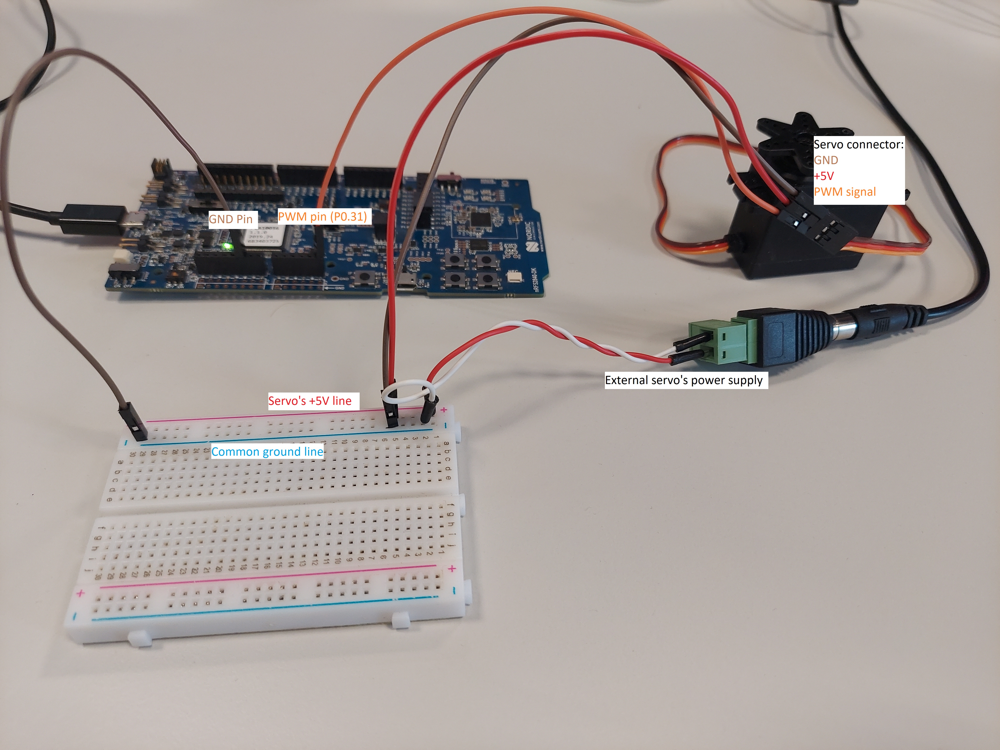

BLE Servo Project
--------------------------
This tutorial will give you an insight on how ``bleservo`` sample application works.

.. contents::
   :local:
   :depth: 2

Prerequisites
~~~~~~~~~~~~~
- Complete other tutorials like: :doc:`Project Blinky <../blinky/blinky>` and :doc:`BLE peripheral project tutorial <bleprph/bleprph>` to famliarize yourself with MyNewt and BLE
- Nordic nRF52 Development board - PCA 10056
- Any simple servomotor to test the application

GATT Server
~~~~~~~~~~~

GATT in this application contains only one custom service, which contains two characteristics with read, write and notify permissions.
Both characteristics contain information about PWM pulse width, however one of them stores this information in the form of servo's tilt angle [degrees] and the other one in pulse duration [microseconds].
This allows the user to control servo in two ways, either with angle or with PWM pulse duration.

Notifications are used to update user's information on both values if one of them has changed. The other corresponding value is calculated before sending a notification. This calculations will be described below, in section PWM Configuration. 

.. code:: c

  static const struct ble_gatt_svc_def gatt_svr_svcs[] = {
      {
          /* Service: Servo */
          .type = BLE_GATT_SVC_TYPE_PRIMARY,
          .uuid = &gatt_svr_svc_servo_uuid.u,
          .characteristics = (struct ble_gatt_chr_def[]) { {
              /* Characteristic: servo angle*/
              .uuid = &gatt_svr_chr_servo_angle_uuid.u,
              .val_handle = &gatt_angle_val_handle,
              .access_cb = gatt_svr_chr_access_servo_angle,
              .flags = BLE_GATT_CHR_F_READ |
                       BLE_GATT_CHR_F_WRITE |
                       BLE_GATT_CHR_F_NOTIFY
          }, {
              /* Characteristic: servo PWM pulse duration*/
              .uuid = &gatt_svr_chr_servo_pulse_duration_uuid.u,
              .val_handle = &gatt_pulse_duration_val_handle,
              .access_cb = gatt_svr_chr_access_servo_pulse_duration,
              .flags = BLE_GATT_CHR_F_READ |
                       BLE_GATT_CHR_F_WRITE |
                       BLE_GATT_CHR_F_NOTIFY
          }, {
              0, /* No more characteristics in this service */
          }, }
      },

      {
          0, /* No more services */
      },
  };

  static int
  gatt_svr_chr_access_servo_angle(uint16_t conn_handle, uint16_t attr_handle,
                                  struct ble_gatt_access_ctxt *ctxt, void *arg)
  {
      int rc;
      switch (ctxt->op) {
      case BLE_GATT_ACCESS_OP_READ_CHR:
          gatt_angle_val = get_servo_angle();
          rc = os_mbuf_append(ctxt->om, &gatt_angle_val,
                              sizeof gatt_angle_val);
          return rc == 0 ? 0 : BLE_ATT_ERR_INSUFFICIENT_RES;

      case BLE_GATT_ACCESS_OP_WRITE_CHR:
          rc = gatt_svr_chr_write(ctxt->om,
                                  sizeof gatt_angle_val,
                                  sizeof gatt_angle_val,
                                  &gatt_angle_val, NULL);
          servo_angle_setter(gatt_angle_val);

          return rc;
      default:
          assert(0);
          return BLE_ATT_ERR_UNLIKELY;
      }
  }

  static int
  gatt_svr_chr_access_servo_pulse_duration(uint16_t conn_handle, uint16_t attr_handle,
                                           struct ble_gatt_access_ctxt *ctxt, void *arg)
  {
      int rc;
      switch (ctxt->op) {
      case BLE_GATT_ACCESS_OP_READ_CHR:
          gatt_pulse_duration_val = get_servo_pwm_pulse_duration();
          rc = os_mbuf_append(ctxt->om, &gatt_pulse_duration_val,
                              sizeof gatt_pulse_duration_val);
          return rc == 0 ? 0 : BLE_ATT_ERR_INSUFFICIENT_RES;

      case BLE_GATT_ACCESS_OP_WRITE_CHR:
          rc = gatt_svr_chr_write(ctxt->om,
                                  sizeof gatt_pulse_duration_val,
                                  sizeof gatt_pulse_duration_val,
                                  &gatt_pulse_duration_val, NULL);
          servo_pwm_pulse_duration_setter(gatt_pulse_duration_val);

          return rc;
      default:
          assert(0);
          return BLE_ATT_ERR_UNLIKELY;
      }
  }
   [...]

Write callbacks of each characteristic call angle or pulse duration setter function. Both files ``gatt_svr.c`` and ``main.c`` need the access to this variables and thanks to this solution, the extern keyword wasn't used in the application. In addition, the boundary conditions of the updated value are checked in this functions and in the end, PWM fracture update event is put to the queue. ``was_angle_passed`` variable is used to keep track of whether the user passed angle or pulse duration value.

.. code:: c

  /* Servo angle setter. Used in gatt_svr.c after receiving new angle value. */
  void
  servo_angle_setter(uint16_t gatt_value)
  {
      if (gatt_value > SERVO_MAX_ANGLE_VAL) {
          servo_angle = SERVO_MAX_ANGLE_VAL;
      } else if (gatt_value < SERVO_MIN_ANGLE_VAL) {
          servo_angle = SERVO_MIN_ANGLE_VAL;
      } else {
          servo_angle = gatt_value;
      }

      was_angle_passed = 1;

      /* After changing servo angle value an event to update PWM fraction is put to the queue. */
      os_eventq_put(os_eventq_dflt_get(), &pwm_frac_update_ev);
  }

  /* Servo PWM pulse duration setter. Called in gatt_svr.c after receiving new pulse duration value. */
  void
  servo_pwm_pulse_duration_setter(uint16_t gatt_value)
  {
      if (gatt_value > SERVO_MAX_PULSE_DURATION_US) {
          servo_pwm_pulse_duration = SERVO_MAX_PULSE_DURATION_US;
      } else if (gatt_value < SERVO_MIN_PULSE_DURATION_US) {
          servo_pwm_pulse_duration = SERVO_MIN_PULSE_DURATION_US;
      } else {
          servo_pwm_pulse_duration = gatt_value;
      }

      was_angle_passed = 0;

      /* After changing servo PWM pulse duration value an event to update PWM fraction is put to the queue. */
      os_eventq_put(os_eventq_dflt_get(), &pwm_frac_update_ev);
  }

PWM configuration
~~~~~~~~~~~~~~~~~

PWM is configured using two structures: ``pwm_chan_cfg`` and ``pwm_dev_cfg``. Fields initialized with ``NULL`` are related to additional PWM features, which we won't use. 

In MyNewt PWM fracture setting is based on number of clock cycles, but the application's characteristics contain variables expressed in more human-friendly units: tilt angle [degrees] or pulse duration [us].
The conversion of this variables is necessary, so the application provides four conversion functions. Each of them transforms one variable into the corresponding value of other variable.
In the ``servo_pwm_init()`` function, after configuration of the PWM, top value of mentioned clock cycles is being assigned to the variable ``pwm_top_val``.
This variable is later used as reference in calculating corresponding values of variables in different units.

.. code:: c

  int
  servo_pwm_init(void)
  {
      struct pwm_chan_cfg chan_conf = {
          .pin = PWM_CH_CFG_PIN,
          .inverted = PWM_CH_CFG_INV,
          .data = NULL,
      };
      struct pwm_dev_cfg dev_conf = {
          .n_cycles = 0,
          .int_prio = PWM_IRQ_PRIO,
          .cycle_handler = NULL,
          .seq_end_handler = NULL,
          .cycle_data = NULL,
          .seq_end_data = NULL,
          .data = NULL
      };

      int rc;

      servo = (struct pwm_dev *)os_dev_open("pwm0", 0, NULL);
      if (!servo) {
          console_printf("Device pwm0 not available\n");
          return 0;
      }

      pwm_configure_device(servo, &dev_conf);

      rc = pwm_set_frequency(servo, SERVO_PWM_FREQ);
      assert(rc > 0);
      rc = pwm_configure_channel(servo, PWM_CH_NUM, &chan_conf);
      assert(rc == 0);

      /* Calculate minimum fracture value */
      pwm_top_val = (uint16_t) pwm_get_top_value(servo);
      servo_frac_max_val = us_to_frac(SERVO_MAX_PULSE_DURATION_US);
      servo_frac_min_val = us_to_frac(SERVO_MIN_PULSE_DURATION_US);
      frac = servo_frac_min_val;

      /* At the beginning of working of the app PWM fracture is set to minimum */
      rc = pwm_set_duty_cycle(servo, PWM_CH_NUM, frac);
      rc = pwm_enable(servo);
      assert(rc == 0);

      return rc;
  }
  
  [...]
  
  /* Conversion functions */
  uint16_t
  angle_to_frac(uint16_t angle)
  {
      return servo_frac_min_val + (angle * (servo_frac_max_val - servo_frac_min_val) / SERVO_MAX_ANGLE_VAL);
  }

  uint16_t
  us_to_frac(uint16_t us)
  {
      return (us * pwm_top_val) / SERVO_PWM_FULL_CYCLE_DURATION;
  }

  uint16_t
  frac_to_angle(uint16_t frac_)
  {
      return (SERVO_MAX_ANGLE_VAL * frac_ - SERVO_MAX_ANGLE_VAL * servo_frac_min_val) /
             (servo_frac_max_val - servo_frac_min_val);
  }

  uint16_t
  frac_to_us(uint16_t frac_)
  {
      return (SERVO_PWM_FULL_CYCLE_DURATION * frac_) / pwm_top_val;
  }

Servo wiring
~~~~~~~~~~~~

Servo's PWM signal wire should be connected to the P0.31 pin of the nRF52840 board. You should also remember about providing the common ground for the nRF52 board and servo's power source.

